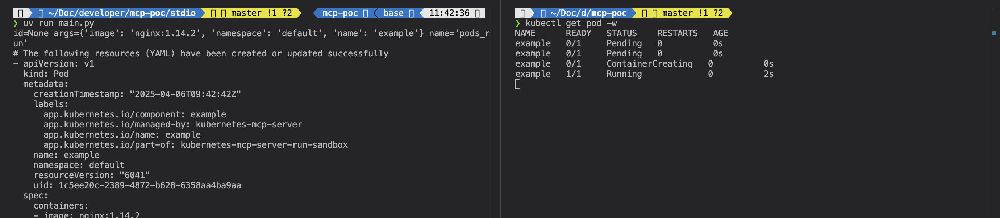
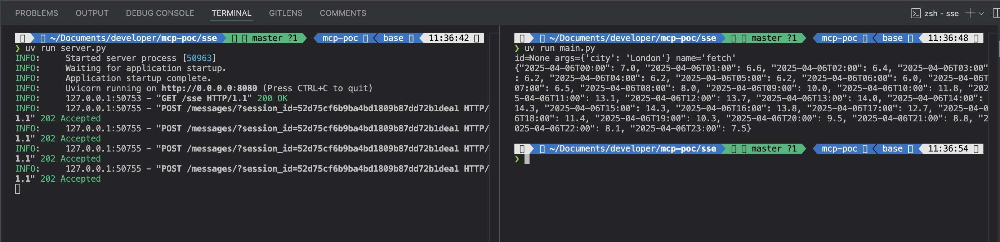

# Model Context Protocol: examples using STDIO and SSE

Google released a [great tutorial](https://ai.google.dev/gemini-api/docs/function-calling?example=weather#use_model_context_protocol_mcp) on using Gemini together with the Model Context Protocol (MCP). It shows how easily you can connect Gemini to a tool, and how simple it is to modify for your use case. 

## STDIO
See [stdio/main.py](./stdio/main.py) on how I used the code Google provides and slightly modify it to let Gemini connect to my local kubernetes cluster using an [MCP extension for Kubernetes](https://www.npmjs.com/package/kubernetes-mcp-server). Running it is done as follows and should give the following output:

```bash
# From the directory mcp-poc/stdio
export GEMINI_API_KEY="YOUR_KEY"
uv run main.py
```



## SSE
The only issue I found with the examples from Google is that the MCP servers run locally, meaning that every client has to run the server. It would be better to have a dedicated server clients can connect to. After looking into the [modelcontextprotocol Github repo](https://github.com/modelcontextprotocol) I found the [`mcp_simple_tool` example](https://github.com/modelcontextprotocol/python-sdk/blob/main/examples/servers/simple-tool/README.md) that has an example of running your MCP server either locally using `stdio` or on a 'different' server which then allows connection with `HTTP` and Server Side Events (`SSE`). 

I therefore took both the `mcp_simple_tool` example and the [weather MCP @philschmidt](https://www.npmjs.com/package/@philschmid/weather-mcp?activeTab=code) made as inspiration and combined it to get a weather MCP that works with SSE. The code can be found in the directory [sse](./sse). It runs as follows and should give the following output:

Terminal 1
```bash
# From the directory mcp-poc/sse
uv run server.py
```

Terminal 2
```bash
# From the directory mcp-poc/sse
export GEMINI_API_KEY="YOUR_KEY"
uv run main.py
```

